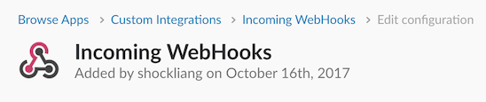
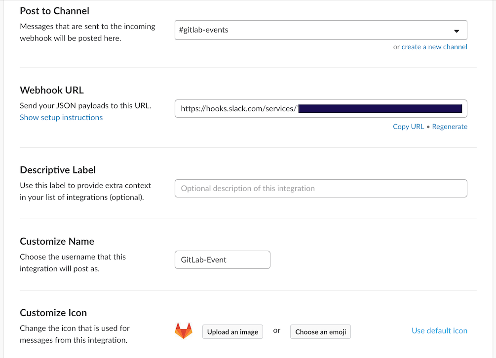
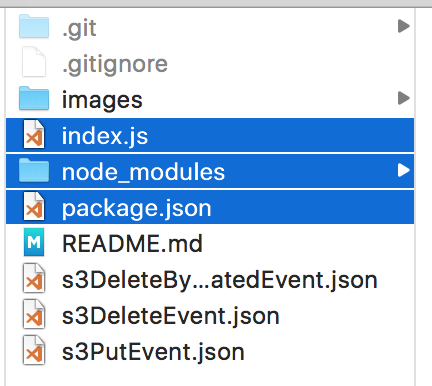
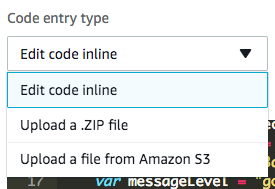
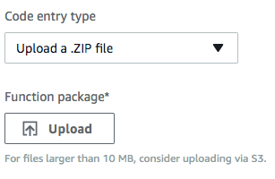
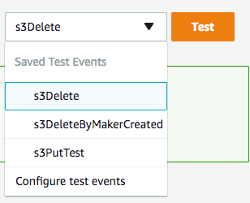
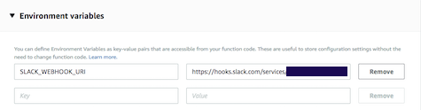
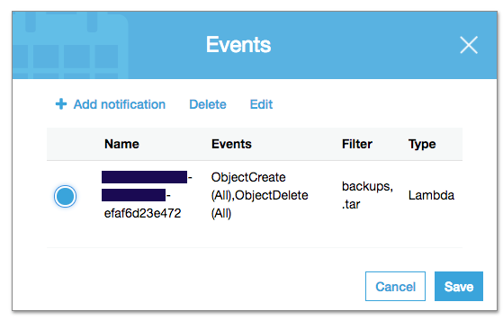
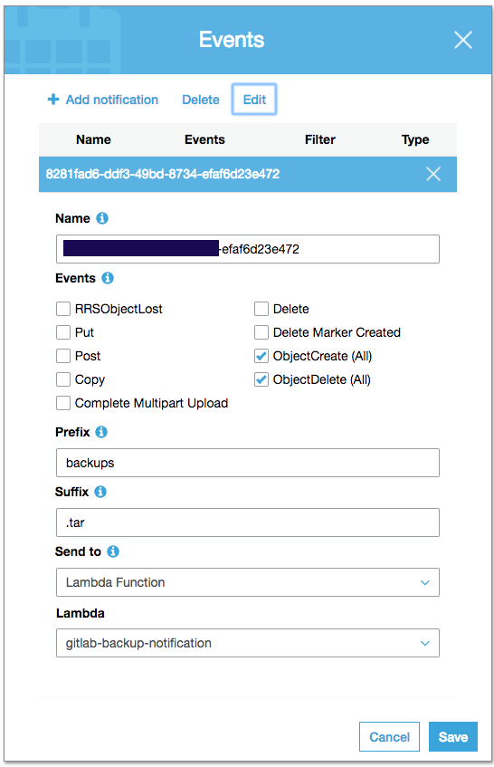

# Using aws lambda to notify slack trigge by S3 bucket action ##

In my case that using gitlab backup to S3 automatic and notify to slack after upload successfully or delete backups.

According this [doc](http://docs.aws.amazon.com/AmazonS3/latest/dev/NotificationHowTo.html#notification-how-to-event-types-and-destinations). 
> You will not receive event notifications from automatic deletes from lifecycle policies or from failed operations.

We can't receive the delete event from lifecycle operations. 

This is main steps:

# Step 1: Create S3 bucket. ###
If using gitlab to upload backups that need `IAM` account to access bucket that will generate id and key to access S3. 

# Step 2: Create a slack `Incoming WebHook` integration #

[Slack message formatting reference](https://api.slack.com/docs/messages)





# Step 3: Create lambda function. #

**If require exteral node modules that will need upload .zip to lambda function first.**

NOTE:Only select main files inside the project. Don't zip whole project.

> 

> 

> 

You can use buildin test json to test out your lambda function.

> 

Using environment variables to store variables or secrets.
```js
var options = {
        uri: process.env.SLACK_WEBHOOK_URI,
        method: 'POST',
        json: attachments
};
```
> 


[S3 delete by maker created event example](s3DeleteByMakerCreatedEvent.json)

[S3 delete by expired event example](s3DeleteEvent.json)

[S3 create event example](s3PutEvent.json)

# Step 4: Binding lambda to S3 event. #

[Referece doc](https://docs.aws.amazon.com/AmazonS3/latest/user-guide/enable-event-notifications.html)




